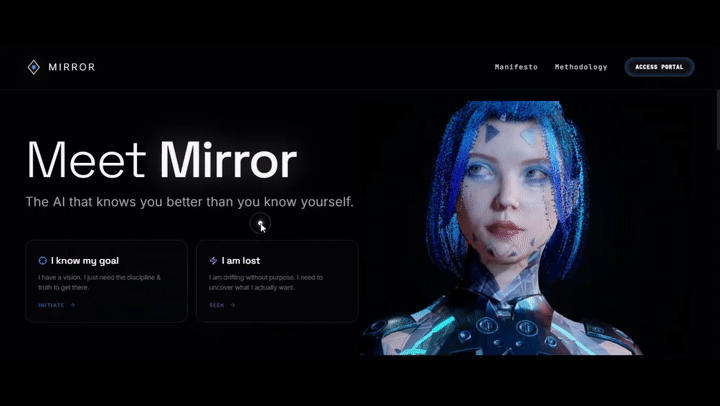
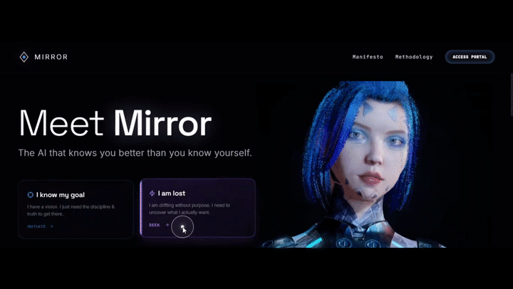
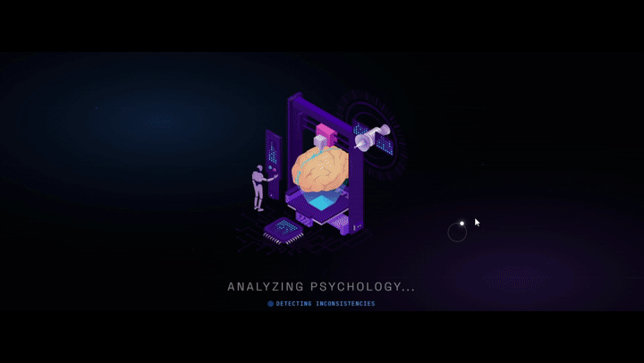
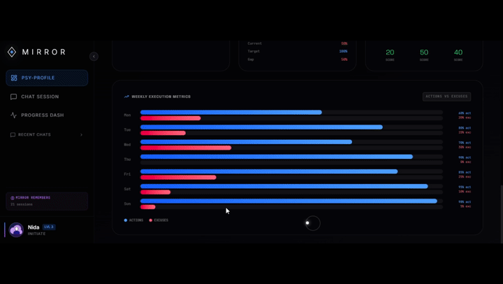
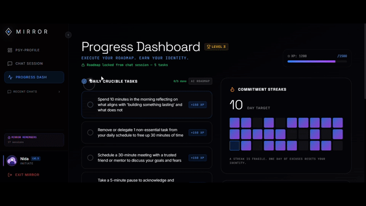

# Mirror — AI Mentor

**Mirror** is an AI-powered mentoring app that replaces generic motivational advice with a brutally honest, personalized psychological profile — built from your own stated goals, excuses, and fears, not a template.

> ⚠️ **Work in progress.** This is an actively evolving portfolio project, not a finished product. See [Known Limitations](#known-limitations--roadmap) below.


  

**Live demo:** [https://mirror-dusky-five.vercel.app/]

---

## What It Does

### 1. Calibration
Onboarding flow that asks targeted questions — your goal, your obstacle, your go-to excuse, your fear.



### 2. Psy-Profile Dashboard
Visual breakdown of discipline, honesty, vision, action, and willpower scores, plus a gap analysis against your stated goal.



### 3. Mentor Chat
Conversational AI mentor that references your actual answers — not generic advice — to challenge excuses and push action.



### 4. Roadmap + Progress Tracking
Generates concrete daily tasks from your chat session, with an XP/streak system to track follow-through.



## Tech Stack

| Layer | Technology |
|---|---|
| Frontend | React 19, Vite 6, TypeScript, Tailwind CSS |
| Animation / Visualization | Framer Motion, Recharts, Three.js (via Sketchfab embed) |
| AI Inference | Groq API (`openai/gpt-oss-120b`) |
| Backend | Vercel Serverless Function (proxies AI calls so the API key never reaches the browser) |
| Deployment | Vercel |

### Why a serverless proxy?

The frontend never calls Groq directly. All AI requests go through `api/mirror.js`, a Vercel serverless function that holds the API key server-side. This keeps the key out of the browser bundle — a deliberate architecture decision, not an afterthought.

## Run Locally

**Prerequisites:** Node.js, a [Groq API key](https://console.groq.com), [Vercel CLI](https://vercel.com/docs/cli) (`npm install -g vercel`)

```bash
# 1. Clone and install
git clone https://github.com/NidaKhaan/mirror-app.git
cd mirror-app
npm install

# 2. Set your API key
# Create a .env file in the root:
echo 'GROQ_API_KEY="your_groq_api_key_here"' > .env

# 3. Run (simulates both frontend + serverless function)
vercel dev
```

`npm run dev` alone will run the frontend but will **not** serve the `/api/mirror` route — use `vercel dev` for full local testing.

## Deployment

Deployed on **Vercel**, connected to this GitHub repo for automatic deployment on every push to `main`. Environment variable `GROQ_API_KEY` is set directly in the Vercel project settings (Production, Preview, and Development).

## Known Limitations & Roadmap

Being transparent about the current state:

- **Rate limits:** Currently running on Groq's free tier. Heavy or concurrent use may hit rate limits — this is a known constraint, not a bug, and is on the list to address (likely via request queuing or a paid tier).
- **Session memory:** Chat history and user profile are currently stored in `localStorage`, so they don't persist across devices or browsers.
- **Planned features:**
  - Voice mode refinement (speech-to-text input exists but is basic)
  - Persistent, account-based memory across sessions
  - Mobile UX polish
  - Usage/cost monitoring on the AI calls

## Project Background

This app was originally deployed on Google Cloud Run via Google AI Studio (using Gemini). After the associated GCP billing account was closed and the local project folder was lost, the source was recovered from a local backup and migrated to a Groq-based architecture with a proper server-side key setup, then redeployed on Vercel.

## Author

Nida Sheraz